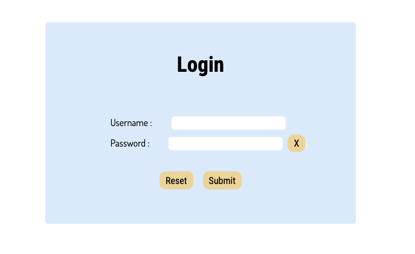
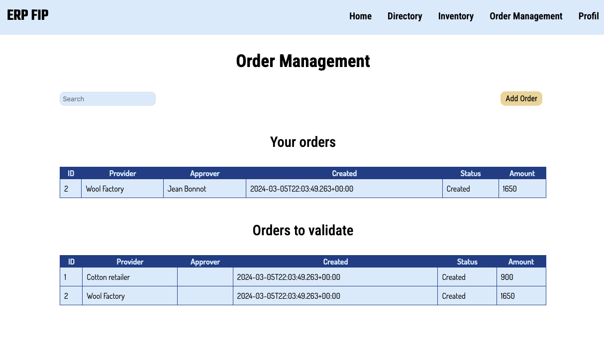

# IMT-3A-PROCOM-ERP

## Description

IMT-3A-PROCOM-ERP is a project to develop a modular Enterprise Resource Planning system.
The solution enables a ready-to-use product to be produced quickly,
for new small businesses of all types (shops, restaurants, etc).
Depending on their needs, companies can have a package with only the necessary functionalities,
while being able to add or remove functionality later almost instantaneously.

Here is a sneak peek :





For the moment, the modules on offer are:

- Authentication service
- Directory service
- Order service

Other services, such as an inventory service, are in the pipeline.

**_NB_**: This project is part of the ProCom teaching unit in the 3rd year of the engineering course at IMT Atlantique.
It is not really intended to be marketed,
but rather to serve as a pedagogical model made to showcase to students the challenges of distribued systems and developing one.

## Using / Deploying our system

You can find a comprehensive [Deployment guide](./docs/DEPLOYING.md) on how to deploy our system, in the [documentation section](./docs).
After having deployed, you can find a comprehensive [Usage guide](./docs/USAGE.md) on how to use our system.

## Metadata

- **Timestamp**: 2023-11-02
- **Last update**: 2024-03-29
- **Status**: In development
- **Current Version**: 1.1.0
- **Supported Platforms**: Windows, Linux and MacOS
- **Development Environment**:
  - [Intellij IDEA 2023.1](https://www.jetbrains.com/idea/)
  - [Visual Studio Code](https://code.visualstudio.com)
  - [Neovim](https://neovim.io)
- **Programming languages**:
  - HTML5 / CCS3 / JavaScript
  - Java 17
  - SQL (PostgreSQL 13)
- **Libraries / Frameworks / Platforms**:
  - [NPM](https://www.npmjs.com)
  - [React JS](https://fr.legacy.reactjs.org)
  - [Apache Maven](https://maven.apache.org)
  - [Spring Boot 3](https://spring.io/projects/spring-boot)
  - [PostgreSQL](https://www.postgresql.org)
  - [Docker](https://www.docker.com)
  - [Postman](https://www.postman.com)
- **Compatibility Issues** : None known at this time

## Repository architecture

```
IMT-3A-PROCOM-ERP/                     This repository
├── README.md                          This document
├── CHANGELOG.md                       Tracked changes in the project's lifecycle
├── CODE_OF_CONDUCT.md                 Code of conduct you have to follow on this project
├── SECURITY.md                        Security information, such as known vulnerabilities, or how to report them
├── LICENSE.md                         License in place for this project
├── deploy.sh                          Complete deploy script (available in a .ps1 for Windows devs)
├── undeploy.sh                        Undeploy script (available in a .ps1 for Windows devs)
├── pom.xml                            Maven parent configuration file for all backend services (modules) for development purposes (IDE LSP detection)
├── .github/                           Used by GitHub for CI/CD processes
│   ├── CODEOWNERS                     Detail which team-member has to review which changes
│   └── workflows/                     All CI/CD auto-running tasks depending on the triggered event
│       └── ...
├── src/                               All the source code of the project
│   ├── frontend/                      Code for the UI
│   │   ├── service-1/                 Subproject with frontend code
│   │   │   ├── Dockerfile             Dockerfile describing the operations required to build each service's image
│   │   │   ├── Public/                Frontend public source code
│   │   │   ├── src/                   Frontend source code
│   │   │   └── ...
│   ├── backend/                       Code for microservices
│   │   ├── service-1/                 One service
│   │   │   ├── pom.xml                Maven child configuration file for the service in development (IDE LSP detection)
│   │   │   ├── prod-pom.xml           Maven child configuration file for the service in production
│   │   │   ├── Dockerfile             Dockerfile describing the operations required to build each service's image
│   │   │   ├── src/                   Backend source code
│   │   │   └── ...
│   │   └── service-n/                 Another service
│   │       └── ...
│   └── databases/                     Databases scripts and configurations
│       ├── db-1/                      One database
│       │   ├── Dockerfile             Dockerfile describing the operations required to build each service's image
│       │   ├── reset.sql              Script to reset all tables in a relationnal database
│       │   └── init.sql               Script to create tables in a relationnal database
│       └── db-n/                      Another database
│           └── ...
│
├── system/                            System files: all entrypoints specific scripts, and centralized certificates
│   ├── db_entrypoint.sh               Entrypoint for the databases
│   ├── entrypoint.sh                  Entrypoint for the backend services
│   ├── mvnw                           Maven Wrapper copied to every service to better control maven version
│   └── wait-for-it.sh                 Handy script that waits for the availability of an service to execute a given command
│
├── security/                          Security scripts (./deploy.sh uses all except for clean_security.sh), all are available in a .ps1 for Windows devs
│   ├── clean_security.sh              Cleans all certificates from the repository
│   ├── docker_secrets.sh              Generates all the docker secrets necessary for the deployment with normal compose
│   ├── docker_secrets_files.sh        Generates all docker secrets in swarm mode
│   ├── security_setup.sh              Generates all needed certificates in the repository
│   └── ...                            Other scripts, such as the docker secrets scripts, or certicate generations
│
├── docker/                            Directory for Docker related files
│   ├── elk /                          Directory for all the Elastic Stack, imported and adapted to our project from deviantony/docker-elk.
│   │   └── ...
│   ├── .env                           Environment variables of the projet
│   ├── docker-compose.yml             Docker containers build script to simulate the project
│   └── docker-compose-swarm.yml       Docker containers build script to simulate the project Swarm mode
│
└── docs/                              All technical and GitHub workflows documentation
    ├── contributing/
    │   ├── workflow-git-action.png    Sequence diagram for a specific action to realise
    │   └── CONTRIBUTING.md            Explains how to contribute to the project, by respecting some rules
    ├── security/                      Security specific files
    │   └── templates/                 Security templates
    ├── api/                           All APIs for all services are documented here
    │   └── doc-api-xxx-service.json   An API documentation
    ├── MODELING.md                    Conception documentation on the ERP's architecture
    ├── ROADMAP.md                     Next steps ahead, for future contributors
    ├── DEPLOYING.md                   A comprehensive guide on how to deploy our system
    └── USAGE.md                       A comprehensive guide on how to use our system once deployed (tailored to educational purposes)
```

## Organisation functioning

The [PROCOM-ERP GitHub organisation](https://github.com/PROCOM-ERP) owns this repository,
meaning that you have to be a member to contribute.
In the organisation, several teams are created in order to affect responsibility, like code review, to members.
They are used in this project in the [CODEOWNERS](.github/CODEOWNERS) file,
to auto-create review requirement when changes impact specific parts of the repository.
For instance: if `backend-owner` team owns `src/backend/`,
any changes in this directory will need a review acceptation from a member of the team before being merged.

## Contributing

[CONTRIBUTING.md](./docs/contributing/CONTRIBUTING.md) file explains how to contribute to the project,
and what are the contributing rules.

We follow a [CODE_OF_CONDUCT.md](CODE_OF_CONDUCT.md), if you want to contribute, you will _have_ to follow it.

## Security

You can verify the versions of this software still maintained to this day, as well as how to report a bug or security issue in the [SECURITY.md](SECURITY.md) section.

For specific internal security documentation, see our security guide at [SYSTEM_SECURITY.md](./docs/SYSTEM_SECURITY.md).

## Suggestions

Any enhancement idea can be suggested in an [Feature Request Issue](https://github.com/PROCOM-ERP/IMT-3A-PROCOM-ERP/issues/new?assignees=&labels=&projects=&template=feature_request.md&title=), following the Feature Request template.

## License

We are under the MIT License, find out more in the [License](./LICENSE.md) section.

## Acknowledgements

Many thanks to the different contributors for their contribution to the project.
Find their names and missions in [Contributors](#contributors) section.

Thanks also to external resources for their open-source samples / documentation:

- [Baeldung](https://www.baeldung.com): Java Spring Boot tutorials and code samples
- [Vertabelo](https://vertabelo.com): Data modeling
- [vishnubob](https://github.com/vishnubob/wait-for-it): wait-for-it.sh script
- [deviantony](https://github.com/deviantony/docker-elk): the entirety of Elastic Stack preconfigured, very helpufl, we only had to adjust it a little as indicated in the [Docker ELK README](./docker/elk/README.md).

## Contributors

- BOPS: _Scrum Master_, _Backend Engineer & Developer_, _Head of Security_, _System Support_
- maestro-bene: _Backend Engineer & Developer_, _System Administrator_, _Security Support_
- Antoine: _Product Owner_, _Frontend & UI/UX Support_
- ArthurMaquinImt: _Backend Engineer & Developer_
- yunea: _Frontend & UI/UX Developer_
