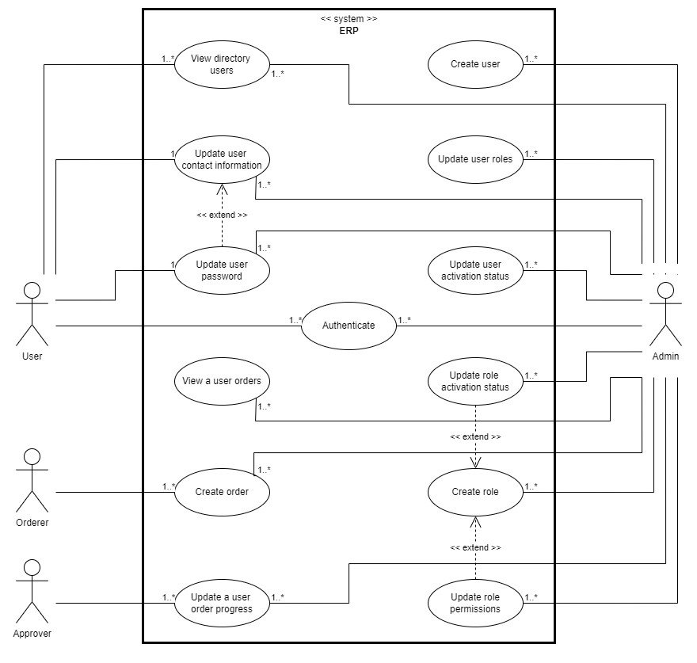

# Application features currently available

## Metadata
- **Timestamp**: 2024-03-31
- **Last update**: 2024-03-31
- **Status**: In development
- **Current Version**: 1.1.0

## Features

Available features in the application are listed below, 
and illustrated in a [use-cas diagram](diagrams/use-case-diagram.png).

| ID   | Description                     | Accessibility                  | Details                            |
|------|---------------------------------|--------------------------------|------------------------------------|
| F001 | Authenticate                    | User (no guest allowed)        |                                    |
| F002 | Create user                     | Admin                          |                                    |
| F003 | View directory users            | User (no guest allowed)        |                                    |
| F004 | Update user contact information | User itself / Admin            |                                    |
| F005 | Update user password            | User itself / Admin            |                                    |
| F006 | Update user roles               | Admin                          |                                    |
| F007 | Update user activation status   | Admin                          |                                    |
| F008 | Create role                     | Admin                          |                                    |
| F009 | Update role permissions         | Admin                          |                                    |
| F010 | Update role activation status   | Admin                          |                                    |
| F011 | View a user orders              | User itself / Admin            |                                    |
| F012 | Create order                    | Orderer / Admin                |                                    |
| F013 | Update a user order progress    | User itself / Approver / Admin | Only approver or admin can approve |

