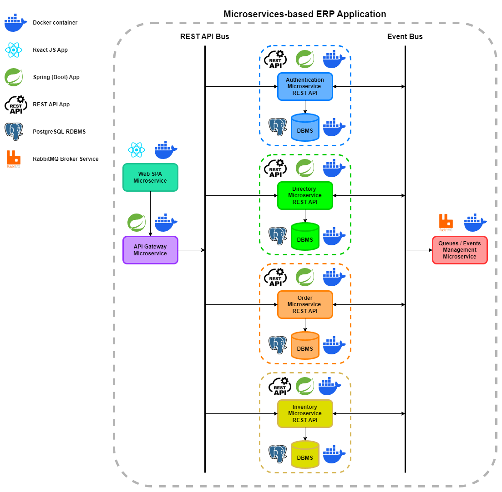

# Simplified modeling report

This report sets out the architecture of this distributed ERP system, 
with a schematic diagram of the various nodes in the system and their respective responsibilities. 
A topology diagram of the message system for internal communications is also provided.

_NOTE: This brief report is not a complete design documentation, 
and is only intended to give an overview of the system as a distributed system._

## Diagrams table of contents

- [System Schematic Diagram](#system-global-functioning)
- [Message System Topology](#message-system-topology)

## System global functioning

This ERP application is based on microservices, each of which is a distinct application with a particular role. 
These microservices each run in a Docker container, and communicate either via the HTTP protocol 
(following the RESTful API model), or via the AMQP protocol (exchanges with RabbitMQ only). 
The diagram below illustrates the infrastructure and the different application technologies of this distributed system, 
at the network node scale.

## Message system topology
