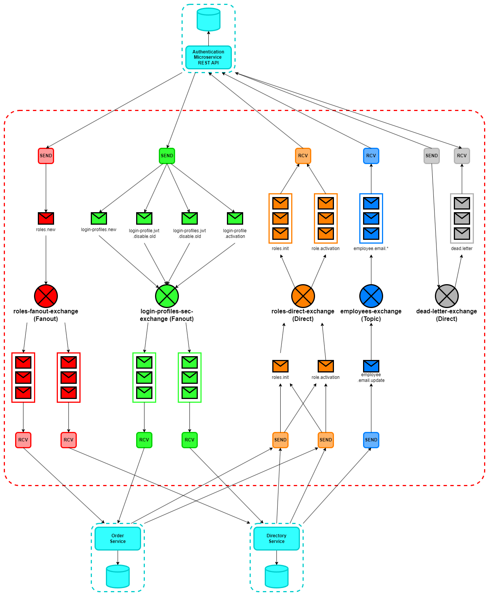

# Simplified modeling report

This report sets out the architecture of this distributed ERP system, 
with a schematic diagram of the various nodes in the system and their respective responsibilities. 
A topology diagram of the message system for internal communications is also provided.

_NOTE: This brief report is not a complete design documentation, 
and is only intended to give an overview of the system as a distributed system._

## Diagrams table of contents

- [System Schematic Diagram](#system-global-functioning)
- [Message System Topology](#message-system-topology)

## System global functioning

This ERP application is based on microservices, each of which is a distinct application with a particular role. 
These microservices each run in a Docker container, and communicate either via the HTTP protocol 
(following the RESTful API model), or via the AMQP protocol (exchanges with RabbitMQ only). 
The diagram below illustrates the infrastructure and the different application technologies of this distributed system, 
at the network node scale.

### Web SPA

In this distributed system, the SPA Web microservice enables the user to access the app functionalities using an HMI. 
It is currently the only front-end service. 

### API Gateway

Then, the API Gateway acts as a link between HTTP requests from the Frontend, 
and routes them to the REST API of the appropriate backend microservice: 
[Authentication](#authentication-service), [Directory](#directory-service),
[Order](#order-service) or [Inventory](#inventory-service).

### Authentication service

Next, the authentication service manages user access to the application. 
Using the RBAC pattern, the service generates Jwt connection tokens, after a BasicAuth authentication (username, password), 
enabling the client to access the application for 1 hour. After this time, they must reconnect. 
If security updates are carried out by the administrators, the tokens may expire earlier than expected. 
This prevents obsolete access authorisations from being maintained.

### Directory service

To continue, the purpose of the directory service is to add, retrieve and update user information 
(contact details, addresses, organisational units and managers). 
Its functionality is fairly simple, although it becomes important when other services need information about users.
Some organisational units already exist,
but the list cannot be modified except by direct interaction with the database.

### Order service

And more, the order service offers only a few basic functions, such as the ability to place orders, 
view them or modify their progress. Some suppliers already exist, 
but the list cannot be modified except by direct interaction with the database.
Its primary purpose is to interact with the directory service to retrieve information about users, 
and more specifically their manager, enabling the order approver to be defined.
It is also designed to notify the network when an order is received, 
information that the inventory service may need to update stocks automatically.

### Inventory service

About the inventory service, it is still a draft and has no Frontend view for the moment.

### Queues-events management / Message-broker service

Finally, the message brokerage service, implemented with RabbitMQ, 
manages the exchange of asynchronous messages between microservices when interactions need to be carried out. 
Depending on the transmission mode (direct, topic, fanout), this service sends the messages to the corresponding queues. 
It also manages message retransmission when message processing fails. 
However, the content of the messages remains fairly simple, 
and the broker only serves to warn the services that they will have to communicate via the Gateway API,
when structurally complex information needs to be shared. 
In this specific case, the API path of the service to be contacted is transmitted in the body of the message sent.

## Message system topology

When messages are exchanged between microservices, it is crucial to identify the senders and recipients of the messages, 
as well as the channels and modes of communication.
In the case of this application, the topology diagram below illustrates the exchanges, 
the queues and the routing patterns, from the senders to the recipients.

_NOTE: logs are available, in logs dashboard or service container, when a message is sent / received._

### Direct (unicast) exchanges

- **roles-direct-exchange**: This exchange manages the notifications linked to the roles managing access. 
  The recipient is always the authentication service, hence its Unicast nature, and the senders can be any other service. 
  Among the messages that circulate here are those informing of the start-up of a service, 
  implying that potential role information is available. 
  Also, the activation of a role in a service triggers a message to be sent to the authentication service to inform it of this.
- **dead-letter-exchange**: This exchange is used to send a message back to RabbitMQ if it has not been processed successfully. 
  Depending on the strategy, the message may or may not be returned. 
  Here, if the authentication service is unable to retrieve the roles from a service that has just started, 
  it sends the message to that service. 
  A delay before new processing is then calculated using the exponential backoff principle, 
  and after 5 failed attempts, the message is destroyed.

### Fanout (broadcast) exchanges

- **roles-fanout-exchange**: This exchange manages the sending of messages when roles are created in the authentication service, 
  so that other services can create them locally. 
  In this way, the administrator can set the usefulness (permissions) of the role in each service.
- **login-profiles-sec-exchange**: This exchange manages the sending of messages linked to users' connection profiles. 
  When a new user is created, all the services create it locally. 
  If it is activated / deactivated, the services repeat the authentication service operation. 
  Finally, if the Jwt tokens of one or more users are due to expire (password change, creation or modification of role activation).

### Topic (multicast) exchanges

- **employees-exchange**: This multicast exchange is used to manage messages relating to user information (contact, etc). 
  Any service, needing information about users, can subscribe to modifications via this exchange, 
  or send messages to request them. This is the case for the authentication service, 
  which would be interested in modifying an email so that, in the future, 
  it can send emails when passwords are reset (not implemented).
